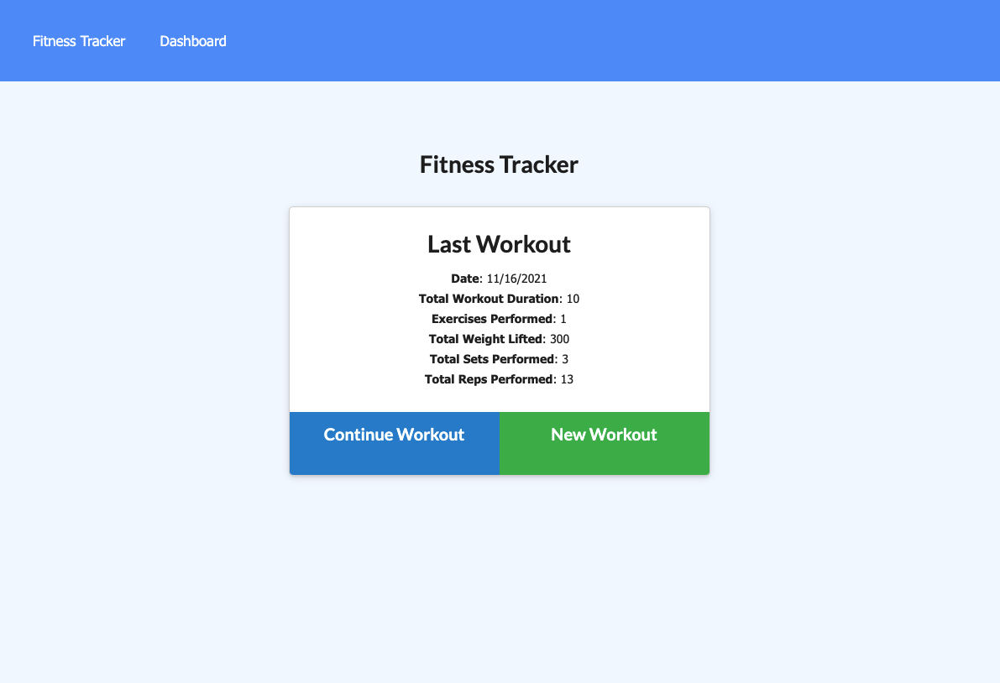
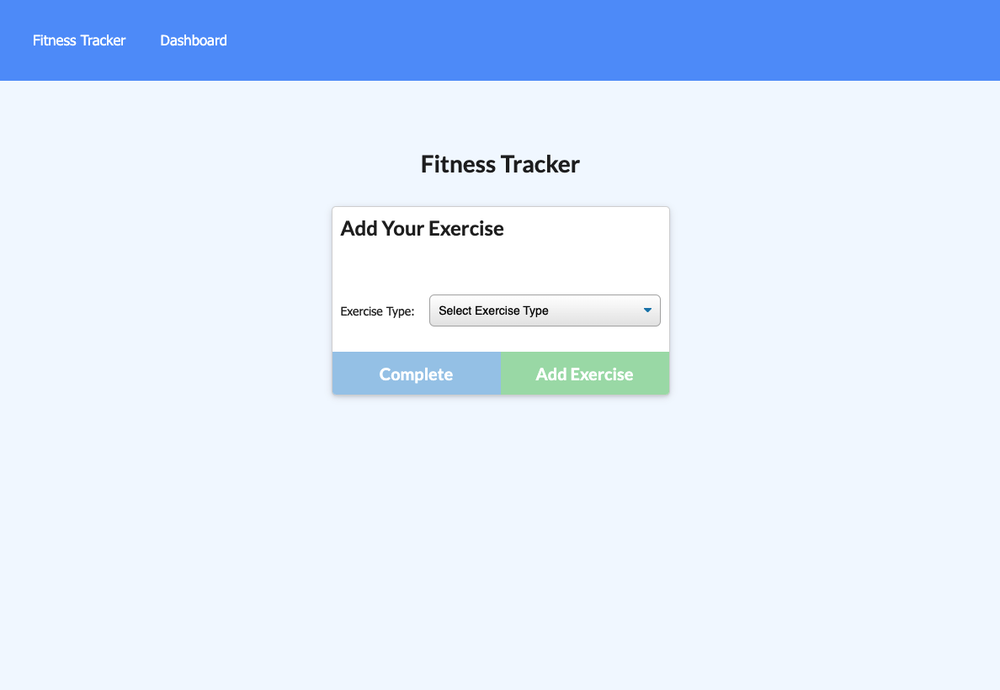
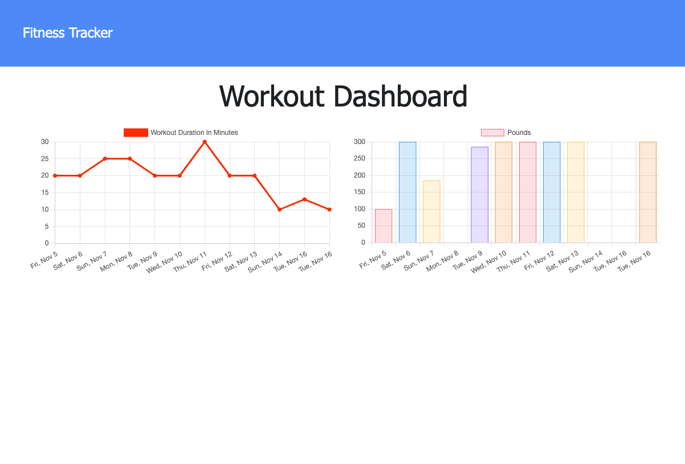

# Workout Tracker

  

  ## Description

  Use MongoDB, Mongoose and Express to make a functioning workout tracker
  
  Click the link below to visit my deployed page.

  https://guarded-earth-38168.herokuapp.com/?id=619464fe03c8840016ec07a7

  <!-- [URL](undefined) -->

  ## Table of Contents
  
  * [Goals](#goals)

  * [Usage](#usage) 

  * [Installation](#installation)  

  * [Test](#test)

  * [Problems](#problems)

  * [Visualization](#visualization)

  * [Acknowledgements](#acknowledgements)

  * [Contributions](#contributions)

  * [Resources](#resources)

  * [License](#license) 

  * [Contact](#contact) 

  
  ## Goals

  Expand my knowledge of MongoDB and Mongoose

  ## Motivation

  Users will reach fitness goals more quickly if they can track their progress. This app will allow a person to record and store workout information 

  ## Usage

  To help record and store workout information. 

  ## Installation
  
  >`npm i`
  
  followed by
  
  >` npm run seed`
  
  followed by
  
  >`node server.js`  

  ## Test

  N/A

  ## Problems

  I had a number of issues deploying to Heroku but I feel like I have learned a lot by working through them. I am better prepared to use it in the future. 

  ## Visualization

 

 

 

  ## Acknowledgements

  Brent Graves was instrumental in helping me figure out how to deploy site

  ## Contributions

  Email me or submit a pull request

  ## Resources
 
  MongoDB, Mongoose and Express

  ## License

  

  This projet uses MIT. 
  
  The link to the License can be found here (https://opensource.org/licenses/MIT)

  ## Contact
  
  GitHub Username: FenixS83 [@FenixS83](https://github.com/FenixS83)

  fenix.sampson@gmail.com

